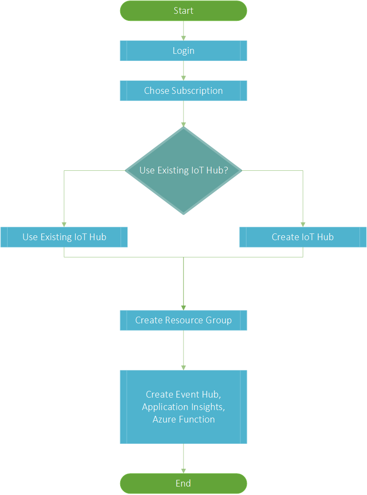

# E2E diagnostic provision CLI &middot;  [](https://www.npmjs.com/package/e2e-happy-deploy) 

# How to use
## Setup Environment
Make sure node version is not less than V7.6.0 (node -v)  
Install Node JS from [here](https://nodejs.org/en/download/)

## Install E2E diagnostic provision CLI from NPM repository
```bash
npm install e2e-diagnostic-provision-cli -g --registry=https://www.myget.org/F/e2e-diagnostic-provision-cli/npm/
e2e-provision
```

# Work flow of E2E diagnostic provision CLI


# Which resources will be deployed

In this tool, we will create several resources necessary for end to end diagnostics.
We will create a new resource group to hold all created resources.  
You can create a new IoT Hub or use existing one.  
Then diagnostics info will be exported to a place. There're 3 choices:

## Store the diagnostics info to Event Hub
If you choose to store the diagnostics info to Event Hub, the flow is like this.


It will create an Event Hub, Application Insights, Storage account(for function app), Function app, and an Web App(For visualization, you can also choose to deploy on your own web server)

## Store the diagnostics info to Storage Account
If you choose to store the diagnostics info to Storage Account, the flow is like this.


It will create an Storage account, and an Web App(For visualization, you can also choose to deploy on your own web server)

## Store the diagnostics info to Log Analytics
If you choose to store the diagnostics info to Log Analytics, the flow is like this.


It will create a Log Analytics, and instead of using a web app to visualize data like previous 2 choices, it will use SQL-like query to generate diagram.
